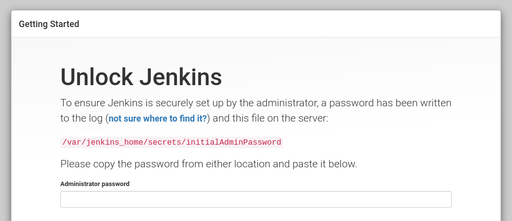

# Jenkins Docker project

## Requirements

To use this repository you must have installed Docker (I used version 20.10.12)
together with Docker Compose (tested on 1.25.0).

## Usage

After cloning the repository, run `docker-compose up -d` and open
[localhost:8000](http://localhost:8000/) in your browser:

```
~/git/jenkins-docker-project$ docker-compose up -d
Starting jenkins-docker-project_jenkins_1 ... done
```



To get the password from the log, run `docker-compose logs | grep -A 3 "initial setup"`
and you'll see the password:

```
~/git/jenkins-docker-project$ docker-compose logs | grep -A 3 "initial setup"
jenkins_1  | Jenkins initial setup is required. An admin user has been created
and a password generated.
jenkins_1  | Please use the following password to proceed to installation:
jenkins_1  |
jenkins_1  | d6e67a80ad6a4a09a131628c3d7c96cf
```
